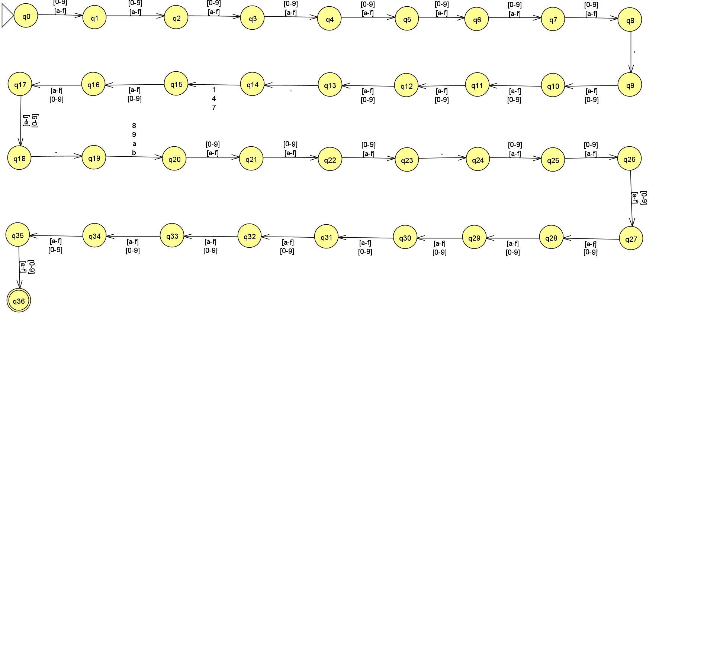

# Webpage UUID Finder

## Descrição

O projeto consiste em uma aplicação web que tem como objetivo encontrar o UUID de uma página web. Atualmente, é compatível com UUID das versões 1, 4 e 7.

## Linguagem Regular

- ∑ = {0, 1, 2, 3, 4, 5, 6, 7, 8, 9, a, b, c, d, e, f, -}
  - ∑ = {[0-9], [a-f], -}
- Q = {q0, q1, q2, q3, q4, q5, q6, q7, q8, q9, q10, q11, q12, q13, q14, q15, q16, q17, q18, q19, q20, q21, q22, q23, q24, q25, q26, q27, q28, q29, q30, q31, q32, q33, q34, q35, q36}
- Estado inicial = q0
- Estado final = {q36}

[Tabela de transições, Gramática Regular](https://univali-my.sharepoint.com/:x:/g/personal/mateus_barbosa_edu_univali_br/EYqIc-UBcoVPtFpvhuTJNs8BDiGUGauYDNf8Zu-EJbnRaA?e=YkyRln)

